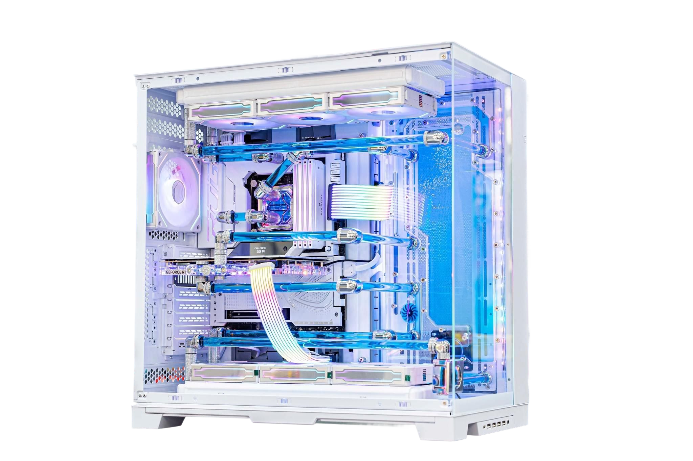

# PDT-Remove.bg

A lightweight and user-friendly tool to automatically remove backgrounds from images using AI.
Perfect for developers, designers, and meme creators who want a quick and clean result — no Photoshop needed!

## Features

* Remove image background in just one command
* Clean & accurate AI-powered removal
* Easy to use for both developers & non-tech users
* Great for avatars, e-commerce product photos, memes, and more

## Demo

| Original Image | Background Removed |
| -------------- | ------------------ |
|    |       |


## 📁 Project Structure

```bash
PDT-Remove.bg/
├── client/                  # Frontend React app
│   └── client/              # React project root
│       ├── public/          # Static assets
│       └── src/             # Main React code (components, pages, etc.)
│           └── assets/      # Demo images (original + processed)
│
├── server/                  # Backend (API call + webhook logic)
│   └── remove_bg.py         # CLI script to call ClipDrop API
│
├── assets/                  # Public image demo folder
├── .env                     # API key stored here
├── requirements.txt         # Python dependencies
└── README.md
```

## 🚀 Technologies Used

### Client-side Application

* **React**
* **Vite**
* **Tailwind CSS**
* **Axios**
* **Clerk (clerk-react)**
* **react-router-dom**
* **lucide-react**
* **react-hot-toast**

### Backend Service

* **Spring Boot**
* **Java 21**
* **Spring Data JPA**
* **Spring Web**
* **Spring Security**
* **MySQL Connector/J**
* **Lombok**
* **jjwt**
* **Spring Cloud OpenFeign**
* **feign-form-spring**
* **Razorpay (optional)**

## 🚪 Getting Started

### Requirements

* Node.js (v18+)
* Java 21
* Maven or mvnw
* MySQL Server
* Clerk account (for auth)
* ClipDrop API key
* VnPay config (for payment)

## ⚙️ Installation

### 1. Backend Setup

```bash
git clone <repo-url>
cd server
```

* Create `.env` and set:

```properties
clipdrop.api.key=your_clipdrop_api_key
clerk.webhook.secret=your_clerk_webhook_secret
vnpay.tmnCode=your_tmn_code
vnpay.hashSecret=your_hash_secret
vnpay.url=your_vnpay_url
vnpay.returnUrl=your_return_url
```

* Set MySQL config in `application.properties`

```properties
spring.datasource.url=jdbc:mysql://localhost:3306/your_db
spring.datasource.username=your_user
spring.datasource.password=your_pass
```

* Run:

```bash
./mvnw clean install
./mvnw spring-boot:run
```

### 2. Frontend Setup

```bash
git clone <repo-url>
cd client/client
npm install
```

* Create `.env`:

```env
VITE_API_BASE_URL=http://localhost:8080/api
VITE_CLERK_PUBLISHABLE_KEY=your_clerk_key
```

* Run:

```bash
npm run dev
```

## 📅 Usage

1. Sign up/in with Clerk
2. Upload image
3. Wait for background to be removed
4. Preview and download result
5. Make payment via VnPay (if needed)

## ✍️ Contributing

Pull requests are welcome! Please follow project structure and formatting.

## 📖 License

MIT License — see [LICENSE](LICENSE)

See you
