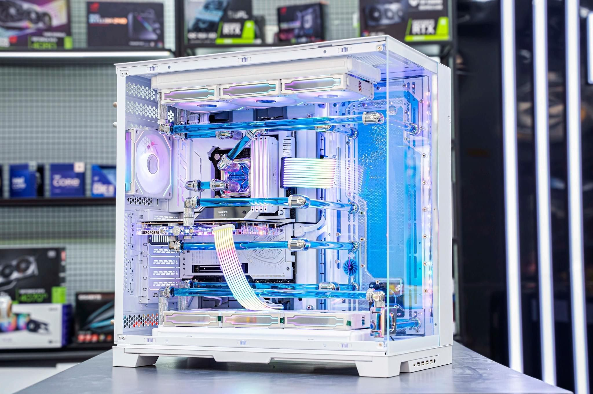

# ✨ PDT-Remove.bg

> Say goodbye to messy backgrounds — and hello to clean, polished images — in just one click!

**PDT-Remove.bg** is a fast, lightweight tool that uses AI magic to remove image backgrounds with precision. Whether you're a developer, a designer, a meme wizard, or just someone who hates Photoshop — this tool is made for you.

---

## 🌟 Features

✅ AI-powered background removal
✅ Ultra-clean, high-resolution outputs
✅ Simple, intuitive web interface
✅ Great for avatars, product photos, memes, banners, and more!
✅ Built-in payment flow for premium usage

---

## 📸 Demo

| 🖼️ Original                             | ✂️ Removed Background                |
| ---------------------------------------- | ------------------------------------ |
|  |  |

---

## 🧠 Tech Stack

### 🖥️ Frontend

* ⚛️ **React** – Component-based UI
* ⚡ **Vite** – Superfast dev/build tool
* 🎨 **Tailwind CSS** – Styling made easy
* 📡 **Axios** – HTTP requests simplified
* 🔐 **Clerk** – Seamless authentication
* 🌍 **react-router-dom** – Routing
* 🔔 **react-hot-toast** – Toast notifications
* 🧩 **lucide-react** – Icon set

### 🛠️ Backend

* 🧩 **Spring Boot** – Robust API backend
* ☕ **Java 21**
* 🧬 **Spring Data JPA** – ORM
* 🛡️ **Spring Security** – Auth & token management
* 💾 **MySQL** – Database
* ✨ **OpenFeign** – External API (ClipDrop) integration
* 🔐 **JWT (jjwt)** – Auth token handling
* 🚀 **Lombok** – Boilerplate reducer

---

## 🗂 Project Structure

```bash
PDT-Remove.bg/
├── client/                  # React frontend
│   └── client/              # Vite project root
│       ├── public/          # Static assets
│       └── src/             # Components, pages, assets
│           └── assets/      # Sample images
│
├── server/                  # Backend (Spring Boot)
│   └── remove_bg.py         # CLI script to call ClipDrop API
│
├── assets/                  # Public images
├── .env                     # Secrets/API keys
├── requirements.txt         # Python dependencies
└── README.md                # You're reading it!
```

---

## 🚀 Getting Started

### Prerequisites

* ✅ Node.js (18+)
* ✅ Java 21
* ✅ MySQL
* ✅ ClipDrop API Key
* ✅ Clerk API Key (optional if not using auth)
* ✅ VnPay credentials (if enabling payment)

---

## ⚙️ Installation Guide

### 🔧 Backend Setup

```bash
git clone <repo-url>
cd server
```

Create a `.env` file:

```properties
clipdrop.api.key=your_clipdrop_api_key
clerk.webhook.secret=your_clerk_webhook_secret
vnpay.tmnCode=your_tmn_code
vnpay.hashSecret=your_hash_secret
vnpay.url=your_vnpay_url
vnpay.returnUrl=your_return_url
```

Update DB config in `application.properties`:

```properties
spring.datasource.url=jdbc:mysql://localhost:3306/your_db
spring.datasource.username=your_user
spring.datasource.password=your_pass
```

Then run it:

```bash
./mvnw clean install
./mvnw spring-boot:run
```

---

### 💻 Frontend Setup

```bash
git clone <repo-url>
cd client/client
npm install
```

Create a `.env` file:

```env
VITE_API_BASE_URL=http://localhost:8080/api
VITE_CLERK_PUBLISHABLE_KEY=your_clerk_key
```

Start the dev server:

```bash
npm run dev
```

---

## 🎮 How to Use

1. 🔐 Sign up or log in via Clerk (optional)
2. 📤 Upload an image
3. 🧠 Let the AI do its job
4. 🔽 Download your clean, background-free image
5. 💳 Upgrade or make payment if required (VnPay supported)

---

## 🤝 Contributing

Contributions are warmly welcome!
Feel free to fork this repo, open a PR, and suggest features or improvements.
Make sure to follow the existing folder structure and code style.

---

## 📄 License

MIT License © 2025 – [LICENSE](./LICENSE)
